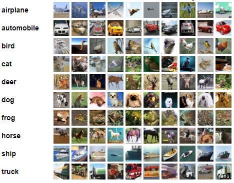
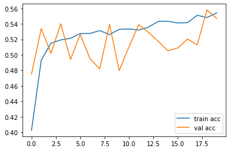
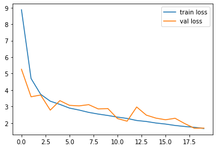

# TransferLearning-CIFAR10-VGG

 In this project, we use pre-trained model (consists VGG architecture and ImageNet weights) in order to recognize the various objects. We use Keras library and these steps have been done
 1. Download dataset automatically using Keras library (if you wish, you can manually download)
 2. Download VGG model and observe architecture(layers)
 3. Modify VGG to our study (change last layers to our purposes)
 4. Train and Save our new Model
 5. Display experimental results on the graphs
 
<div align="center">
  
  
</div>

## Introduction
* [Transfer Learning](https://keras.io/guides/transfer_learning/) : Transfer learning is a machine learning technique where a model trained on one task is re-purposed on a second related task. We can think of transfeering to learnt features to the new model. In this way, we can utilize some pre-trained model which trained by billions of image which we may not be able to train ourselves. In this project, we use **VGG19 Pre-trained Model** which was trained by ImageNet dataset (1000 classes). Then, we change last three layers for our study, in order to classify 10 categories, not 1000. The top-1 and top-5 accuracy refers to the model's performance on the ImageNet validation dataset.
---------------------------------------------------------------------------------------------
| Model       | Size          |  Top 1 Accuracy| Top 5 Accuracy	   |  Parameters     | Depth |
|-------------|-------------  |----------------|-------------------|-----------------|-------|
|   VGG19     |  549 MB       |      0.719    | 0.900             |  143,667,240	   |   26  |
----------------------------------------------------------------------------------------------

* [Keras](https://keras.io/getting_started/) : Keras is an open-source software library that provides a Python interface for artificial neural networks. Keras uses TensorFlow or Theano libraries as backend. Keras is a powerful and easy-to-use free open source library for developing and evaluating deep learning models. We utilizi lots of built-in functions

* [CIFAR-10 DATASET](https://www.cs.toronto.edu/~kriz/cifar.html) : The CIFAR-10 and CIFAR-100 are labeled subsets of the 80 million tiny images dataset. They were collected by Alex Krizhevsky, Vinod Nair, and Geoffrey Hinton. The CIFAR-10 dataset consists of 60000 32x32 colour images in 10 classes, with 6000 images per class. There are 50000 training images and 10000 test images. CIFAR-10 includes these classes and some example images.



## Requirements & Dependencies
* We build our algorithm using "Anaconda Environment" on Jupyter Notebook.
* Required packages and libraries are given as txt file (bio-env.txt). You can directly create environment and activate like this:
  
  ```bash
  conda env create --file bio-env.txt
  conda activate env
  ```
 * If you want to install libraries manually, then fundamental packages are as follows
 -----------------------------
| Library     |  Version      |
|-------------|-------------  |
|   Tensorflow    |   1.14.0           |
|   Keras         |   2.3.1          |
|   Pandas        |   1.1.3          |
|   Numpy         |   1.19.1            |
|   Matplotlib    |   3.3.1          |
-----------------------------
 
## Usage
* Download this repository and run CIFAR10-TransferLearning.
* Note: Since we download dataset and model via Keras (internet connection is necessary), we do not need to download anything explixitly. We can run file simply. 


## Experiment Results
Result of the experiments as shown below. Notice that, there are hyper-parameters (epoch and batch size, optimizer, loss function etc) that should be considered and therefore, results can be different. 

 

